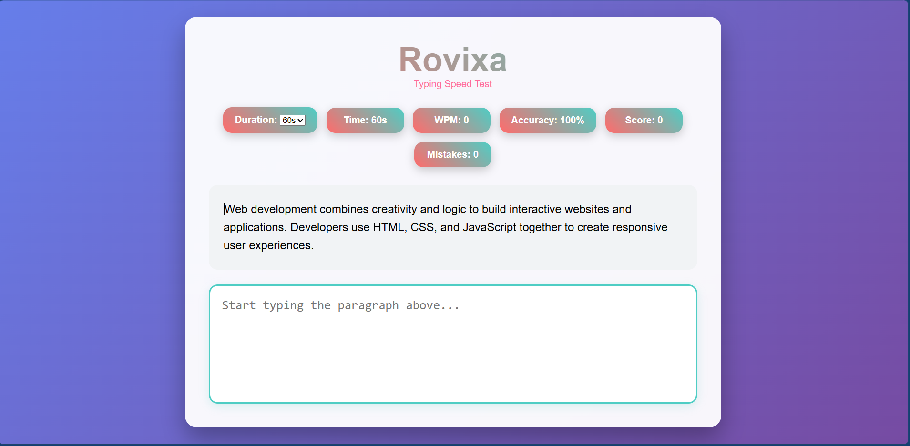
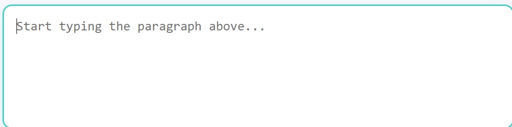
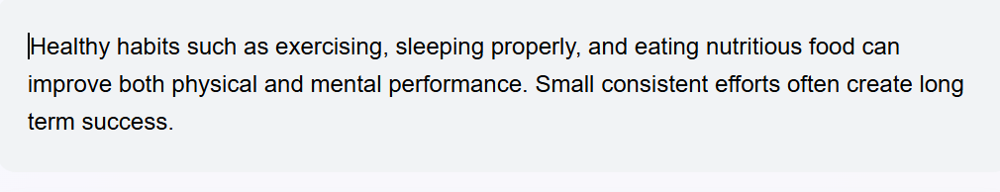
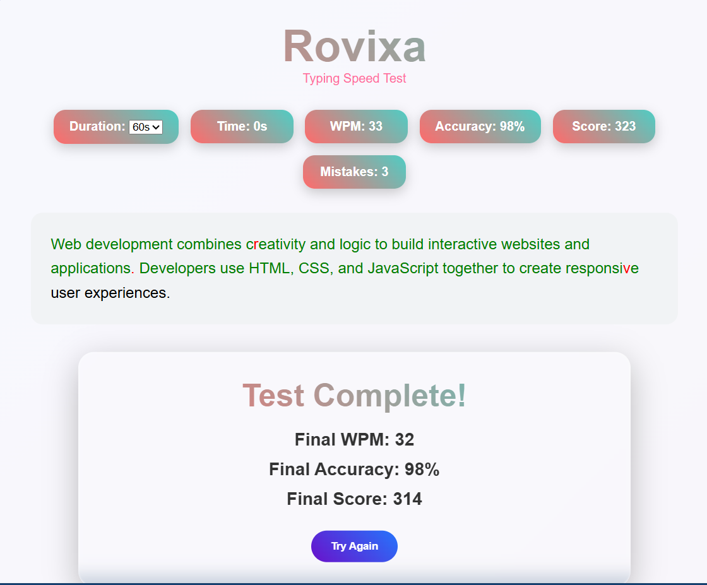

# ⌨️🔥 Rovixa – Modern Typing Speed Test Web Application

Rovixa is a modern, responsive, and interactive typing speed test web application developed using HTML, CSS, and JavaScript. 🚀

This project is designed to help users improve their typing speed, accuracy, focus, and consistency through real-time performance tracking and engaging UI interactions.

Rovixa provides a smooth and visually attractive typing experience with modern gradients, animations, sound effects, and dynamic paragraph generation. 💻✨

---

# 🌟 Features

## ⚡ Real-Time Typing Statistics
- ⌛ Live Timer
- 🚀 Real-Time WPM Calculation
- 🎯 Accuracy Percentage Tracking
- ❌ Mistake Counter
- 🏆 Dynamic Score System

---

## 🧠 Smart Typing System
- 📄 Random paragraph generation
- 🔄 Multiple paragraph support
- 🎯 Character-by-character validation
- 🟢 Correct character highlighting
- 🔴 Incorrect character highlighting
- ✨ Active typing cursor effect

---

## 🔊 Sound Effects
- 🔔 Wrong typing beep sound
- 🎉 Completion success sound
- 🎵 Smooth sound synchronization

---

## 🎨 Modern User Interface
- 🌈 Gradient background design
- 💎 Glassmorphism inspired result card
- ✨ Smooth hover animations
- 📱 Fully responsive layout
- 🖥️ Clean and professional UI

---

## ⏱️ Multiple Time Modes
Users can select different typing durations:
- ⌛ 15 Seconds
- ⌛ 30 Seconds
- ⌛ 45 Seconds
- ⌛ 60 Seconds

---

# 🛠️ Technologies Used

| Technology | Purpose |
|------------|---------|
| HTML5 | Structure of the application |
| CSS3 | Styling, layout, animations |
| JavaScript | Typing logic and interactivity |

---

# 📂 Project Structure

```bash
Rovixa-Typing-speed-test/
│
├── index.html
├── styles.css
├── script.js
│
└── sounds/
    ├── wrong.mp3
    └── complete.mp3

    # 🚀 How To Run The Project

Follow these simple steps to run Rovixa on your system:

### 📥 Step 1: Download The Project
Download or clone this repository to your computer.

You can also download the ZIP file directly from GitHub and extract it.

---

### 📂 Step 2: Open The Project Folder
After downloading, open the project folder.

Make sure these files are available:

- index.html
- styles.css
- script.js
- sounds folder

---

### 🔊 Step 3: Verify Sound Files
Inside the sounds folder, make sure these audio files exist:

- wrong.mp3
- complete.mp3

These files are required for sound effects.

---

### ▶️ Step 4: Run The Project
Double click the `index.html` file.

OR

Right click → Open With → Any Browser

Examples:
- Google Chrome
- Microsoft Edge
- Mozilla Firefox

---

### ⌨️ Step 5: Start Typing
- Select the typing duration
- Start typing the displayed paragraph
- Track your:
  - WPM
  - Accuracy
  - Mistakes
  - Score

---

### 🎉 Step 6: View Results
After the timer ends:
- Final WPM is displayed
- Final Accuracy is calculated
- Final Score is generated
- Completion sound is played

You can click:
`Try Again`
to restart the test.

---

# 💡 Important Note

If sounds are not working:
- Make sure the sounds folder exists
- Verify file names:
  - wrong.mp3
  - complete.mp3

Incorrect folder structure may prevent audio from loading properly.

# 📸 Project Preview

### 🏠 Home Screen


### ⌨️ Typing Area


### 📄 Paragraph Display


### 🎉 Result Screen

